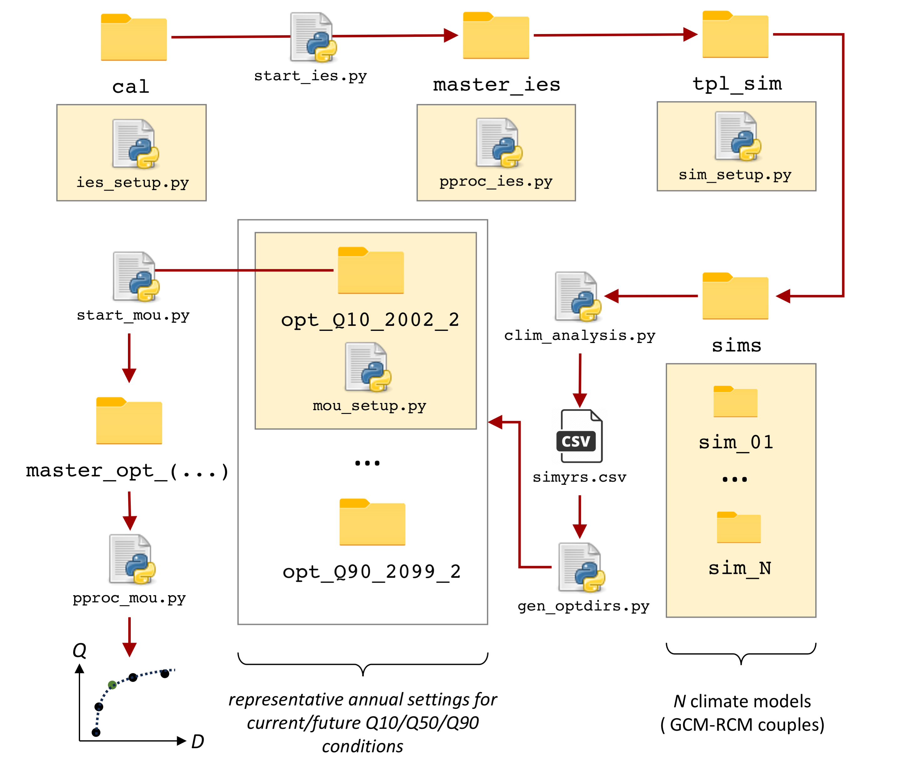

<H1 align="center"> 
Estimation of acceptable pumping rates under multiple climate scenarios by constrained multi-objective optimization with a surface-subsurface flow model 
</H1>

Description
-----------------------------------------------

A fully script-based worked example for the estimation of current (2076-2005) and future (2069-2099) *acceptable* pumping rates in rivers and aquifers by multi-objective optimization under parametric uncertainty. We account for both climate model uncertainty and inter-annual variability with the identification annual conditions corresponding to the 10-th, 50th, and 90-th quantiles of groundwater recharge. 

Based on a real-world case-study the *Lizonne* watershed (600 $\mathrm{km}^2$, Nouvelle Aquitaine, France), the model simulates the surface water budget, stream and groundwater flows in transient state. 

Pumping from streams and wells are both accounted for. The soil water budget is solved at the daily time step for each surface model cells considering a simplified soil map. Stream flow routing is computed at the daily time step and groundwater flow equations every two days. 

Requirements
-----------------------------------------------

*Executables*
+ [marthe](https://www.brgm.fr/en/software/marthe-modelling-software-groundwater-flows)
+ [pest-pp](https://github.com/usgs/pestpp/)

*Python packages*
+ [PyEMU](https://github.com/pypest/pyemu)
+ [PyMarthe](https://github.com/apryet/adeqwat/tree/master)
+ Numpy, Pandas, ...

Calibration with IES
-----------------------------------------------

Adjustable model parameters (719) : 
+ distributed hydraulic properties at pilot points (horizontal hydraulic conductivity, storage coefficient and drainable porosity for unconfined and confined aquifers, respectively). Spacing of pilot points 4 km in aquifers, 8 km in aquitards. 
+ river bottom hydraulic conductivity, by reaches
+ soil storage capacity, runoff partition and vadose zone percolation parameter, by soil zones (2 zones in simplified soil map). 

Observations (15439): 
+ heads in observation wells (16)
+ discharge rates at gaging stations (4)

Calibration period: August 2012 to July 2019 (6 years, after a 2-year initialisation period).

Iterative Ensemble Smoother with 232 realizations, converges after ca. 5 iterations. 

Optimization with MOU
-----------------------------------------------

A constrained, multi-objective optimization is implemented. Parametric uncertainty is accounted with the final, filtered parameter ensemble (stack) from IES. 

Decision variables are multipliers of historic pumping rates (783) : 
+ by river reach and month for river pumping
+ by aquifer layer and month for groundwater 
Only summer months are considered (June to September).

Simulation period: January to December, after a 16-month initizalization period (hot restart with initial heads from long-term run, no initial steady state).  

Optimization by PSO/NSGA-II with a population size of 116.

Workflow  
-----------------------------------------------

+ The initial model files are placed into the `cal` folder
+ `ies_setup.py`is run to setup the control, instruction and template files for IES
+ `start_ies.py` generates the master and worker directories and calls `pestpp-ies` in parallel. 
+ `pproc_ies.py` generates plots and update `tpl_sim`, the template simulation directory with calibrated ensembles
+ `sim_setup.py` setup long term simulation runs (1955-2099) for each gcm/rcm couple in `sims`.
+ `run_fullsim.py` is run in each simulation directories in `sims` with `run_sims.sh`
+ `clim_analysis.py` performs a statistical analysis over the current and future 30-year reference periods to identify the Q10, Q50, and Q90 quantiles.
+ `gen_optdirs` reads `simyrs.csv` and generate the optimisation directories
+ `mou_setup.py` setup optimization control file 

